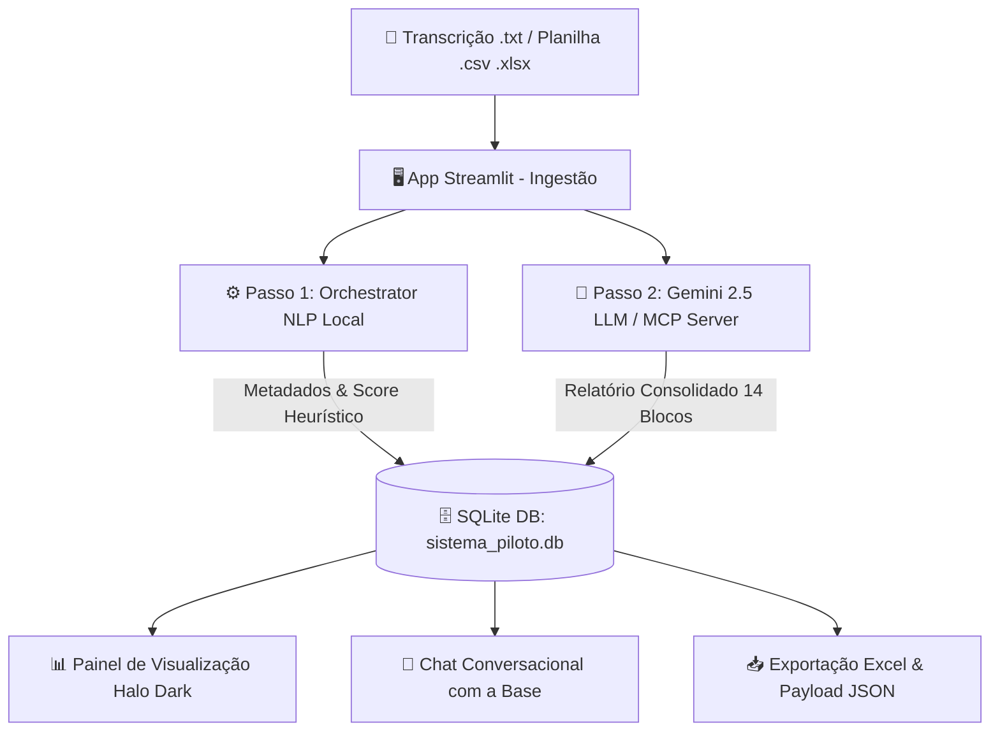

# 🚀 Halo. | Sistema de Auditoria de CX e Qualidade Automatizada (Banco Daycoval)


Plataforma de inteligência operacional e auditoria automatizada de interações de atendimento ao cliente (voz/transcrição e texto) do **Banco Daycoval**. 

O sistema utiliza uma arquitetura híbrida de **NLP Heurístico de Alta Performance** e **Inteligência Artificial Generativa (Google Gemini LLM)** integrados via **Model Context Protocol (MCP)** para auditar 100% dos atendimentos, gerar notas objetivas por pilares de qualidade, diagnosticar causa raiz de atritos e formular planos de ação executivos.

---

## 🎯 Principais Funcionalidades

- 📊 **Auditoria Completa em 14 Blocos**: Relatório executivo estruturado cobrindo pontuação do operador, conformidade operacional, atritos de jornada (CES/Fricção), inaderências e causa raiz técnica.
- ⚡ **Processamento Híbrido em 2 Passos**:
  - **Passo 1 (NLP Local)**: Execução instantânea sem custo de API para pré-classificação e scoring heurístico.
  - **Passo 2 (Gemini LLM / MCP)**: Consolidação profunda com a LLM (`gemini-2.5-flash` / `gemini-2.5-pro`) produzindo análises qualitativas humanas.
- 📁 **Ingestão Flexível & Lote**: Suporte a transcrições individuais (`.txt`) e processamento massivo de planilhas (`.csv`, `.xlsx`).
- 📥 **Exportação Enriquecida**: Download de relatórios executivos em Markdown, JSONs padronizados e planilhas Excel enriquecidas com métricas de CX.
- 💬 **Chat Conversacional Analítico**: Assistente virtual RAG que responde dúvidas estratégicas diretamente sobre a base histórica de auditorias.
- 🔌 **Servidor e Cliente MCP**: Integração nativa com a arquitetura MCP para disponibilizar ferramentas de auditoria para assistentes e agentes autônomos.

---

## 🏗️ Arquitetura do Sistema



---

## 📋 Estrutura dos 14 Blocos de Auditoria

| Bloco | Nome do Bloco | Descrição |
| :--- | :--- | :--- |
| **1** | **Cabeçalho do Atendimento** | Protocolo, Data, Atendente, Cliente, CPF, Categoria, Produto e Canal. |
| **2** | **Classificação Executiva** | Status do caso (🟢 Caso Controlado, 🟡 Ponto de Atenção, 🟠 Relevante, 🔴 Crítico). |
| **3** | **Feedback da Monitoria** | Pontos Positivos, Pontos de Melhoria e Coaching Sugerido. |
| **4** | **Tabela de Notas por Pilar** | Pontuação em Relacionamento (50), Resolutividade (10), CX (40) e Penalidades. |
| **5** | **Detalhamento da Monitoria** | Avaliação item a item por critérios formais com evidências citadas. |
| **6** | **Inaderências Críticas** | Identificação de desvios operacionais grave/zera atendimento. |
| **7** | **Diagnóstico da Experiência** | Score CES (Customer Effort Score), Nível de Esforço e Fricção na Jornada. |
| **8** | **Indicadores CES de Jornada** | Troca de canal, retrabalho e reaberturas. |
| **9** | **Riscos e Impactos** | Probabilidade de Ouvidoria, Bacen, Procon ou Churn. |
| **10** | **Causa Raiz & Responsabilidade**| Motivo aparente, Causa Raiz Técnica e Dono da Jornada. |
| **11** | **Insights da Interação** | Visão tática de oportunidade para o operador e CX. |
| **12** | **Falhas Operacionais** | Mapeamento de gargalos em sistemas, processos ou treinamento. |
| **13** | **Recomendações e Plano de Ação** | Ações corretivas com Prioridade, Responsável e Prazo. |
| **14** | **Conclusão Executiva** | Resumo estratégico sintetizado para a liderança. |

---

## 📂 Estrutura do Repositório

```text
sistemaPiloto/
├── app.py                   # Interface principal Streamlit (Halo Dark Design)
├── database.py              # Camada de persistência SQLite3 (sistema_piloto.db)
├── nlp_orchestrator.py      # Motor de análise NLP local e chamadas Gemini LLM
├── mcp_server.py            # Servidor Model Context Protocol para auditoria
├── mcp_client.py            # Cliente MCP para consumo de ferramentas
├── inspect_prompt.py        # Utilitário para inspeção de prompts
├── requirements.txt         # Dependências do projeto Python
├── sistema_piloto.db        # Banco de dados SQLite local
├── .streamlit/
│   └── config.toml          # Configurações de tema Streamlit
├── chaveGemini/
│   ├── gemini_fabio_exemplo.txt  # Arquivo modelo para chave API
│   └── regrasOrquestradoras.md   # Prompt master e regras de auditoria
├── auditorias/              # Cache de relatórios de auditoria JSON
├── transcricoes/            # Base de arquivos de áudio transcritos
└── modelagem/               # Documentação de modelagem dos dados
```

---

## 🛠️ Como Executar o Projeto

### Prerequisitos
- Python 3.10 ou superior instalado.
- Chave de API da Google Gemini ([Google AI Studio](https://aistudio.google.com/)).

### 1. Clonar o Repositório
```bash
git clone https://github.com/araujofran/sistemaMonitoriaEberReplica2.git
cd sistemaMonitoriaEberReplica2
```

### 2. Instalar Dependências
```bash
pip install -r requirements.txt
```

### 3. Configurar a Chave API Gemini (Opcional para modo Real)
Crie o arquivo `chaveGemini/gemini_fabio.txt` e insira sua chave da API Gemini:
```bash
echo "SUA_CHAVE_GEMINI_AQUI" > chaveGemini/gemini_fabio.txt
```
*(Caso não adicione a chave, o sistema funcionará normalmente no **Modo Simulado / NLP Local**).*

### 4. Iniciar a Aplicação Streamlit
```bash
streamlit run app.py
```
Acesse no seu navegador em: `http://localhost:8501`

---

## 🎨 Design System (Halo Dark)

A interface utiliza uma paleta **Halo Dark** customizada via CSS injetado diretamente no Streamlit:
- **Background Base**: `#0A0B0F`
- **Surface Containers**: `#14151C` / `#1E2029`
- **Accent Indigo**: `#5B68FF`
- **Accent Cyan**: `#3DD7E5`
- **Typography**: Inter & JetBrains Mono (Google Fonts)

---

## 📄 Licença
Desenvolvido para fins de prototipação e automação de auditoria de qualidade.
